**OBJECTIVE**:

To study the behaviour of mild steel rod subjected to gradual increasing equal loads at 1/3rd span and to determine its mechanical properties.

**STEPS**:

1. When you click on a Bending test on mild steel, a new window will open as shown below.  
   [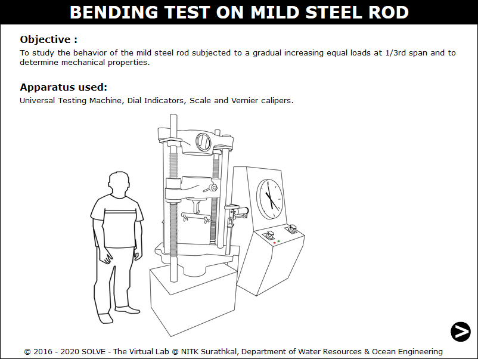](./images/proc1.png)

2. Click on the NEXT button at the bottom right corner to move to the next step.  
   [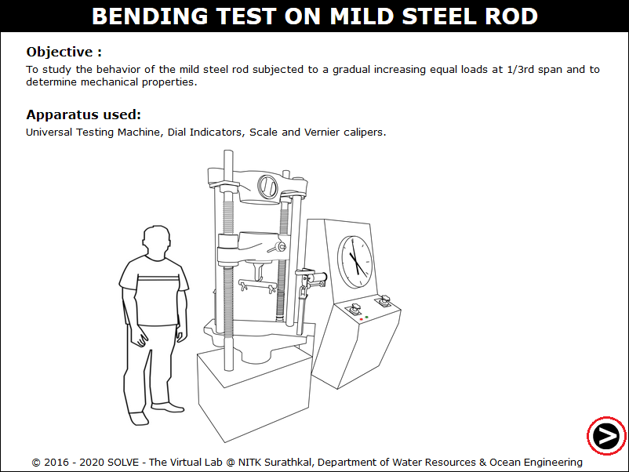](./images/proc2.png)

3. Click on the specimen, then to measure the diameter click on vernier calliper, and then click on NEXT button.  
   [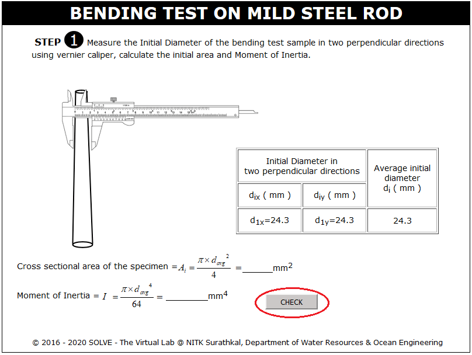](./images/proc3.png)

4. Click on measuring scale to measure the length of the specimen.  
   [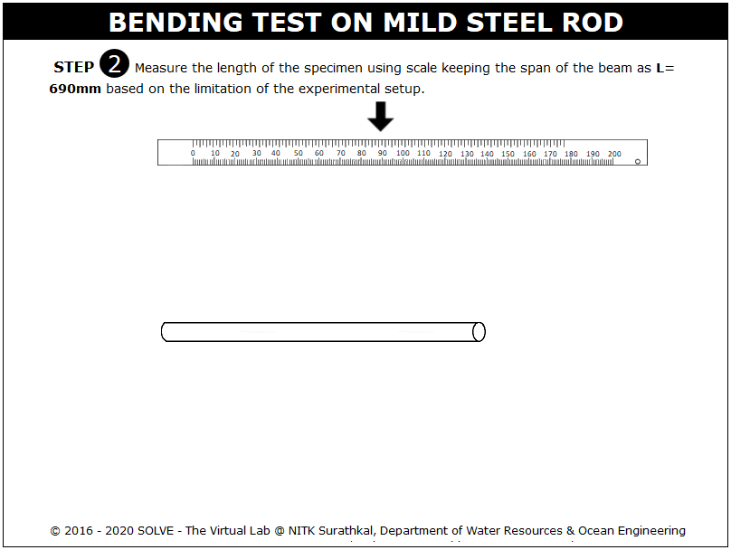](./images/proc4.png)

5. Here, click on hand to mark center and 1/3rd points on the specimen to mount dial gauge.  
   [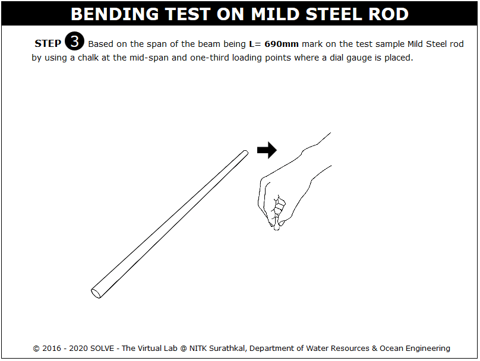](./images/proc5.png)

6. Click on chalk marked specimen to keep it in experimental setup.  
   [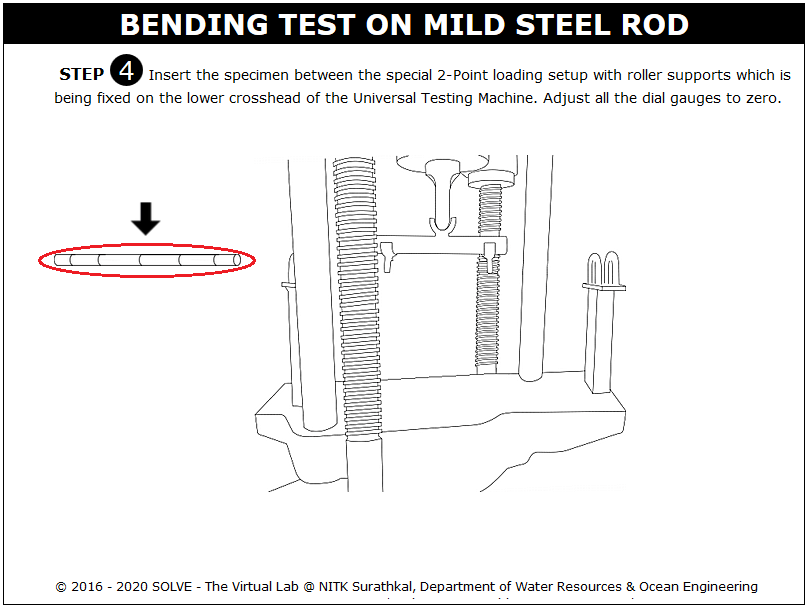](./images/proc6.png)

7. To start the loading click on GREEN button.  
   [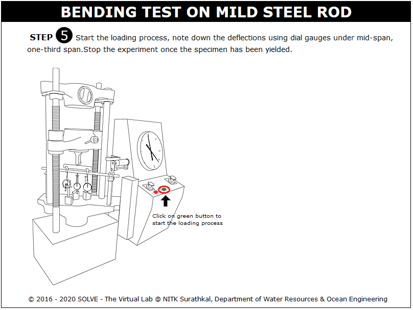](./images/proc7.png)

8. Click RED button to stop the loading process, click download data to download the test observations.  
   [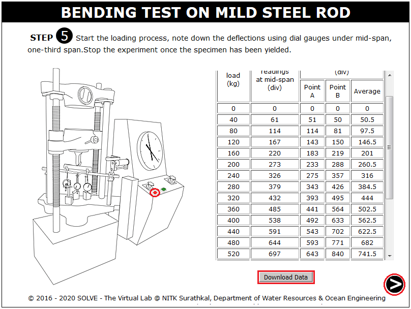](./images/proc8.png)

9. The failure pattern of the specimen is shown here, click NEXT button to view the graphs.  
   [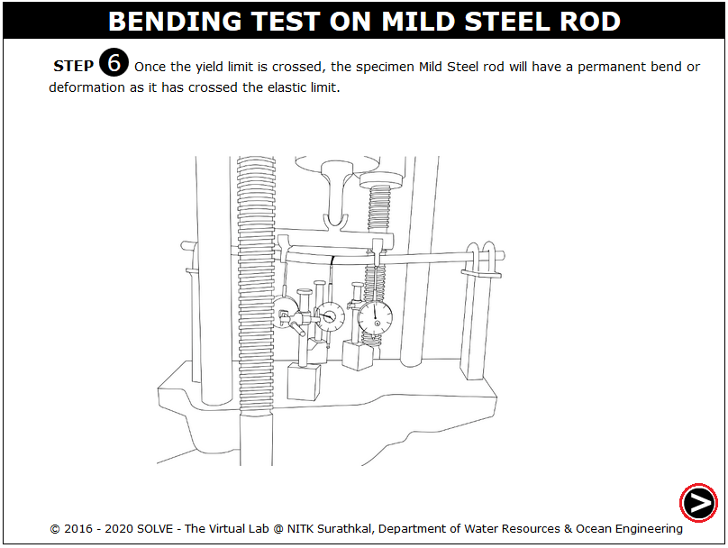](./images/proc9.png)

10. Click on VIEW DATA to view the test observations and VIEW SLOPE to view the slope drawn to the plot.  
    [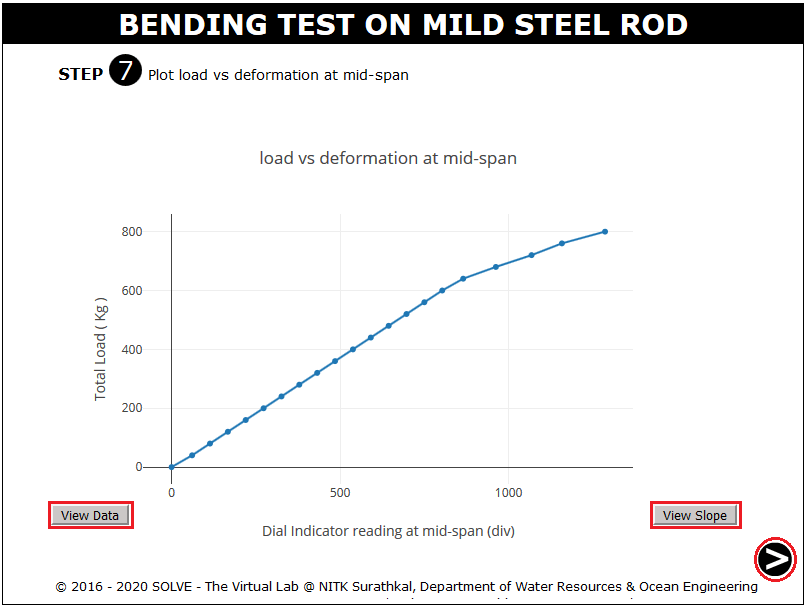](./images/proc10.png)

11. Click on VIEW DATA to view the test observations and VIEW SLOPE to view the slope drawn to the plot, then click NEXT button.  
    [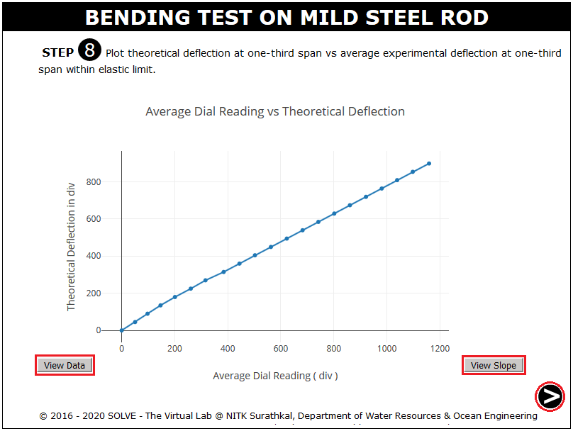](./images/proc11.png)

12. Enter the calculated value and then click CHECK to verify the result.  
    [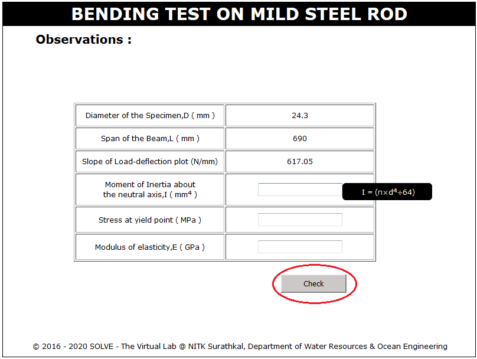](./images/proc12.png)
