

Bending strength is defined as a material's ability to resist deformation under load, it represents the highest stress experienced within the material at its moment of rupture. There are two types of bending tests. Three point bending test and four point bending test. In a three point bending test the area of uniform stress is quite small and concentrated under the centre loading point. In a four point bending test, the area of uniform stress exists between the inner span loading points (typically half the outer span length).

When a specimen is bent, it experiences a range of stresses across its depth. At the edge of the concave face the stress will be at its maximum compressive value. At the convex face of the specimen the stress will be at its maximum tensile value. Most materials fail under tensile stress before they fail under compressive stress, so the maximum tensile stress value that can be sustained before the specimen fails is its flexural strength. The flexural strength would be the same as the tensile strength if the material were homogeneous. Therefore the flexural properties of a specimen are the result of the combined effect of all three stresses as well as (though to a lesser extent) the geometry of the specimen and the rate the load applied. Bend testing provides insight into the modulus of elasticity and the bending strength of a material.

From bending equation,

[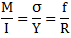](./images/bending1.png)

[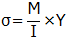](./images/bending2.png)

Two point loads 'P/2' are applied at a distance of 1/3 L from the ends.

[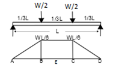](./images/bending3.png)

The moment due to two point loads P/2 at 1/3rd span is [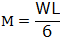](./images/bending4.png)
and moment of inertia about the neutral axis is [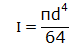](./images/bending5.png)

Then the yield stress is

[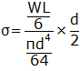](./images/bending6.png)

[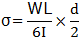](./images/bending7.png)

Then to determine the deflection at the centre of the span,

Deflection with respect to A is = moment of M/EI diagram between AE about A

[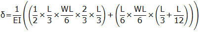](./images/bending8.png)

[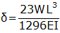](./images/bending9.png)

Then the deflection at B above E is =moment of M/EI diagram between BE about B

[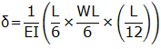](./images/bending10.png)

[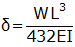](./images/bending11.png)

The deflection of B below A= [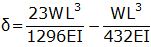](./images/bending12.png)

Then the deflection under point load P/2 at B is [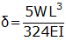](./images/bending13.png)

**TEST PIECE**:

Round, square, rectangular or polygonal sections are used in this test. Any areas of the material affected by shearing or flame cutting and similar operations during the cutting of the test piece shall be removed. The edges of rectangular test pieces shall be rounded to a radius not exceeding one-tenth of the thickness of test pieces. During bending the unmachined side of the test piece shall be at the tension side.

**The variation of modulus of rupture with position of application of load**:

[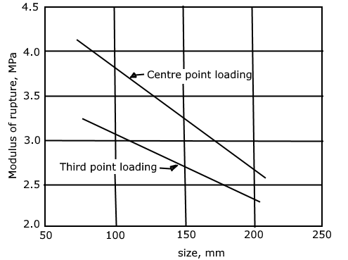](./images/bending14.png)

**RELEVANT INDIAN STANDARD FOR BENDING TEST ON MILD STEEL**:

1. IS 5242 (1979): Method of test for determining shear strength of metals.
